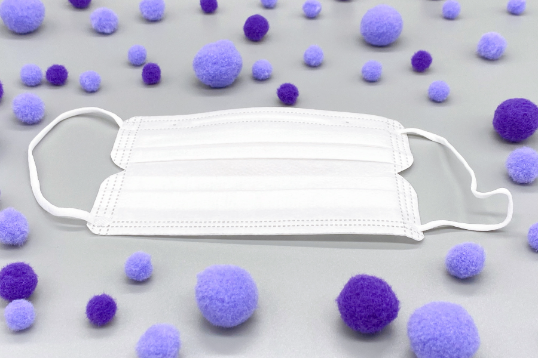
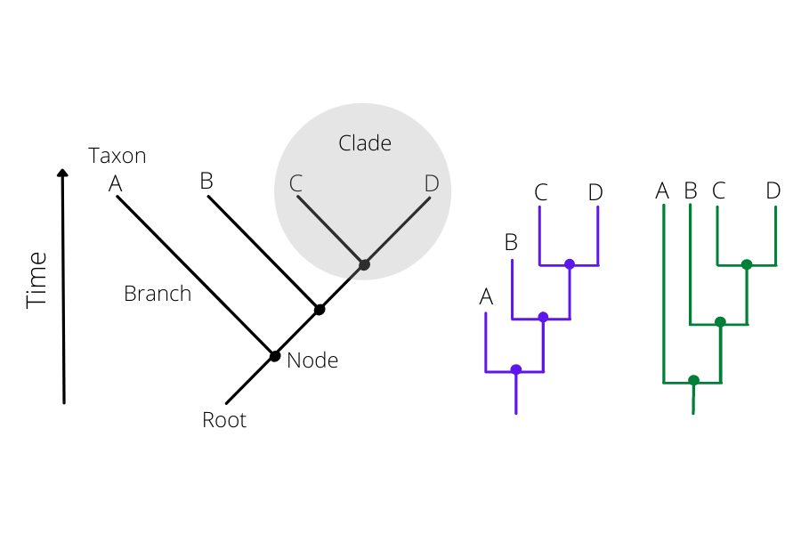
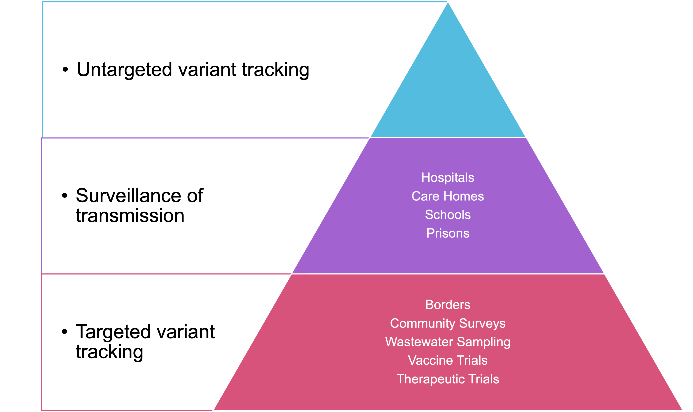

# EPIDEMIOLOGY AND TRACKING IN A PANDEMIC

             
@Canva

# How to tackle a respiratory virus?
<!-- 3-2 --> 
 
When an infected person sneezes, coughs, eats, sings or even whispers, they release air droplets and aerosols that can carry viruses long distances. The table below compares some of the characteristics of droplets with those of aerosols.

| Droplet 					| Aerosol 					|
|----------------------------------------------------------|----------------------------------------------------------|
| > 5 μm (may be much larger) 		| < 5 μm 					|
| Short range (<2 m) 				| Long range – (up to km) 			|
| Short dwell time 				| Long dwell time – need air handling 	|
| Resistant to environmental damage 	| Readily dry 					|
| Can enter upper airway 			| Can enter lower airway 			|

People who are not protected against a particular airborne virus are susceptible to becoming infected and transmitting the disease to new hosts. Preventive measures for most respiratory infections include vaccinations, use of face covering, ventilation and air circulation, and hand hygiene.

**Vaccination:** stimulates the immune system to produce antibodies and trigger immune responses against its target when an individual encounters the virus. Not all vaccines prevent infection, but all of them are designed to mitigate severe disease and death. 

**Face covering:** a physical barrier that prevents the spread of infective droplets and aerosols. Their efficiency depends on their filtration capacity. Cloth face coverings, although mitigating the spread of the virus, allow the dissemination of small infective particles, whereas filtering facepiece masks (FFP2 or N95) can filter up to 95% of droplets (Figure 1).

 

_Source [Science Advances](https://www.science.org/doi/10.1126/sciadv.abd3083)_

[Click here to enlarge the image](images/OC1_3-2_Fig1.png)

[Download Figure 1 alt-text here](images/OC1_3-2_alt-text.pdf)

**Ventilation**: open windows increase the circulation and renewal of the air in a room. The viral particles in the air are carried outside the room, significantly reducing the number of virus particles in suspension and the spread of the infection.

**Hand hygiene:** we can touch contaminated surfaces and bring the pathogens to our mouth and nose, where the viruses can infect the mucosa cells. Although this is not the main route of COVID-19 spread, hand washing is a preventive measure for most infectious diseases. 

# Introduction to Phylogenetics
<!-- 3-4 -->     

In biology, evolution is the process of modification and adaptation that passes on from an organism to its future generations. In the context of SARS-CoV-2, mutations in the spike gene are examples of such changes. A mutation is a genetic variation, such as a change of a nucleotide (e.g an adenine substituted by a cytosine). A group of three nucleotides (codon) encodes an amino acid (subunits of proteins). Nucleotide changes can lead to an amino acid substitution. For instance, the [D614G mutation of SARS-CoV-2 Spike protein](https://doi.org/10.1016/j.cell.2020.11.020) means that the original virus had an aspartate (D) at the 614th residue (amino acid) of the Spike and that the new variant has now a glycine (G) replacing it. Deletions or insertions of nucleotides can also cause alterations to the protein.

Phylogenetic inferences apply models and algorithms to reconstruct the evolutionary history of a group of organisms. It evaluates genetic changes (e.g mutations) to predict similarities and relationship pathways between organisms. These relationships are visualised through cladograms and phylogenetic trees, which are graphical representations of the phylogenetic inferences. A cladogram is a simple representation of the hypothetical ancestry of a group of organisms, whereas a phylogenetic tree uses data analysis to infer the actual similarity among these organisms. 

Figure 2 depicts a cladogram (in black) of four organisms or taxa A-D and their hypothetical evolutionary relationships through time. Each taxon has a connection (branch) to a node. The length of the branch is an inference of the evolutionary steps or genetic changes from the analysed organisms to their common ancestor, represented by a node. A clade is composed of a group of taxa that shares a common node/ancestor, also known as a lineage in the context of SARS-CoV-2. The root represents the hypothetical last common ancestor of the analysed group. Purple and green cladograms are just different graphical representations of the same inference. 

[Click here to enlarge the image](images/OC1_3-4_Fig2.png)

[Donwload Figure 2 alt-text here](images/OC1_3-4_alt-text.pdf)

# Surveillance around the world
<!-- 3-5 -->

<!-- YT https://youtu.be/_6TtEqLxJyo -->             
<iframe width="840" height="472" src="https://www.youtube.com/embed/_6TtEqLxJyo" title="YouTube video player" frameborder="0" allow="accelerometer; autoplay; clipboard-write; encrypted-media; gyroscope; picture-in-picture; web-share" allowfullscreen></iframe>

[Donwload the transcript here](assets/OC1_3-5_transcript.pdf)

The SARS-CoV-2 virus spread rapidly across the world, and networks were developed to sequence the virus and track its spread.

In this recorded video call, in January 2022, you will hear from experts from the [Africa CDC](https://africacdc.org), [COG-UK](https://www.cogconsortium.uk) and the [Philippine Genome Center](https://pgc.up.edu.ph) about genomic surveillance in their regions. 

# Identifying transmission clusters: Hospital outbreak investigation in the United Kingdom
<!-- 3-6 -->      

<audio controls>
  <source src="assets/OC1_3-6_audio.m4a" type="audio/ogg">
 </audio>

[Download the transcript here](assets/OC1_3-6_audio_transcript.pdf)

In this audio, Stephanie Hutchings shares her professional experience during the early days of the pandemic. Listen to a case study where she outlines an example where genomic surveillance was ultimately not helpful in investigating an outbreak at a hospital in the United Kingdom.

# Surveillance of viruses in a population
<!-- 3-7 -->      

<!-- YT https://youtu.be/qqEDfAlJ54A -->       
<iframe width="840" height="472" src="https://www.youtube.com/embed/qqEDfAlJ54A" title="YouTube video player" frameborder="0" allow="accelerometer; autoplay; clipboard-write; encrypted-media; gyroscope; picture-in-picture; web-share" allowfullscreen></iframe>

[Download the transcript here](assets/OC1_3-7_transcript.pdf)

[Download the presentation slides here](assets/OC1_3-7_slides.pdf)

In this recorded lecture, you will hear from Dr Carolina Torres from the [Proyecto Argentino Interinstitucional de genómica de SARS-CoV-2 (PAIS)](http://pais.qb.fcen.uba.ar). PAIS is sequencing SARS-CoV-2 to characterise if variants are detected in the circulating virus. This is very important to track the ongoing evolution of the virus.

Efforts like these around the world help to detect variants quickly and allow scientists to study their impact on the human populations in their country.  

# Genomic surveillance and its impacts
<!-- 3-8 -->      

<!-- YT https://youtu.be/RR3NZThcTWc -->         
<iframe width="840" height="472" src="https://www.youtube.com/embed/RR3NZThcTWc" title="YouTube video player" frameborder="0" allow="accelerometer; autoplay; clipboard-write; encrypted-media; gyroscope; picture-in-picture; web-share" allowfullscreen></iframe>

[Download the transcript here](assets/OC1_3-8_transcript.pdf)

In this recorded lecture, hear from Prof Thanat Chookajoorn, of the [COVID-19 Network Investigations Alliance (CONI)](https://coni.team) about the importance of genomic surveillance, and how this was used in the pandemic response in Thailand. 

# Sequencing surveillance options
<!-- 3-9 -->     

[Click here to enlarge the image](images/OC1_3-9_Fig3.png)

[Donwload Figure 3 alt-text here](images/OC1_3-9_alt-text.pdf)

When deciding which samples to sequence, there are many options depending on the capacity of your network, the stage of the pandemic in your country and the most pressing public health questions requiring answers. The figure above shows some different categories of samples and one way of thinking about prioritisation. 

Whilst these priorities will be different in each setting, it is almost universally accepted that the most important and primary activity in genomic surveillance is the tracking of different lineages and variants. This is best achieved by taking a random, unbiased and geographically representative sample of cases. This approach will be informative as to the lineages circulating, potentially at low levels depending on the size of the sample. 

Specifically sampling in hospitals, intensive care units, suspected imported cases and care homes can answer very important targeted public health questions but, without being accompanied by general surveillance, risks a bias in the data. 

# What can we do better for the pandemics that may come?
<!-- 3-11 -->       

<!--YT https://youtu.be/sxNhMuwCgIg -->       
<iframe width="840" height="472" src="https://www.youtube.com/embed/sxNhMuwCgIg" title="YouTube video player" frameborder="0" allow="accelerometer; autoplay; clipboard-write; encrypted-media; gyroscope; picture-in-picture; web-share" allowfullscreen></iframe>

[Download the transcript here](assets/OC1_3-11_transcript.pdf)

There is always the potential for a disease outbreak to become a pandemic. It's a scary thought! On this video call, we asked Dr Gerald Mboowa, from the [Africa CDC](https://africacdc.org), for his advice for future pandemics. 

# Resources

A useful range of COVID-19 and SARS-CoV-2 additional resources. From databases to top-trump cards  

Protein structure repository: [RCSB Protein Data Bank](https://www.rcsb.org/news?year=2020&article=5e74d55d2d410731e9944f52&feature=true)  
RCSB PDB Educational Portal: [PDB-101](https://pdb101.rcsb.org/)  
Coronavirus biology: [ViralZone](https://viralzone.expasy.org/9056)  
Coronavirus taxonomy: [International Committee on Taxonomy of Viruses (ICTV)](https://talk.ictvonline.org/taxonomy/)  
Real-time tracking of pathogen evolution: [NextStrain](https://nextstrain.org/ncov/gisaid/global)  
Lineages nomenclature: [Pango](https://cov-lineages.org/index.html)  
Genomic data sharing: [GISAID](https://www.gisaid.org/)  
Cloud Infrastructure for Big Data Microbial Bioinformatics: [CLIMB](https://www.climb.ac.uk/)  
COVID-19 Genomics UK Consortium: [COG-UK](https://www.cogconsortium.uk/)  
COVID-19 Vaccine top-trump cards: [LaPipette](https://lapipette.com/vaccine_cards)  
NCBI COVID-19 scientific literature: [LitCovid](https://www.ncbi.nlm.nih.gov/research/coronavirus/)

